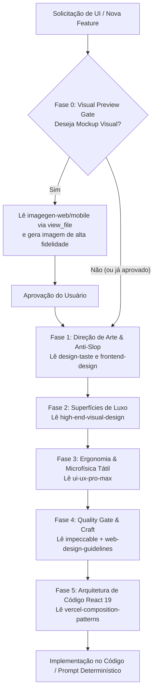

# Frontend Director — Orquestrador Mestre de UI/UX & Engenharia React

O **Frontend Director** é a mente orquestradora do frontend do projeto. Ele centraliza e **garante a execução em profundidade** de 9 skills especializadas, evitando atalhos, inconsistências visuais, o visual amador de IA e a proliferação descontrolada de boolean props em componentes React.

---

## 🚨 REGRA MANDATÓRIA: LEITURA OBRIGATÓRIA DOS ARQUIVOS DE SKILL (DEEP-READING)

> [!CRITICAL]
> **O agente NÃO PODE confiar apenas nos resumos contidos nesta página.**
> Para cada fase a ser executada, o agente **É OBRIGADO a executar a ferramenta `view_file`** no arquivo `SKILL.md` correspondente (usando o caminho do workspace `.agents/skills/...`) antes de gerar mockups, escrever código ou montar prompts.

| Fase | Skill a Carregar | Caminho Relativo ao Workspace | Link Relativo |
|---|---|---|---|
| **Fase 0 (Mockup Web)** | `imagegen-frontend-web` | `.agents/skills/imagegen-frontend-web/SKILL.md` | [imagegen-frontend-web/SKILL.md](../imagegen-frontend-web/SKILL.md) |
| **Fase 0 (Mockup Mobile)** | `imagegen-frontend-mobile` | `.agents/skills/imagegen-frontend-mobile/SKILL.md` | [imagegen-frontend-mobile/SKILL.md](../imagegen-frontend-mobile/SKILL.md) |
| **Fase 1 (Anti-Slop & Mood)** | `design-taste-frontend` | `.agents/skills/design-taste-frontend/SKILL.md` | [design-taste-frontend/SKILL.md](../design-taste-frontend/SKILL.md) |
| **Fase 1 (Design Intencional)** | `frontend-design` | `.agents/skills/frontend-design/SKILL.md` | [frontend-design/SKILL.md](../frontend-design/SKILL.md) |
| **Fase 2 (Superfícies de Luxo)** | `high-end-visual-design` | `.agents/skills/high-end-visual-design/SKILL.md` | [high-end-visual-design/SKILL.md](../high-end-visual-design/SKILL.md) |
| **Fase 3 (Ergonomia & UX)** | `ui-ux-pro-max` | `.agents/skills/ui-ux-pro-max/SKILL.md` | [ui-ux-pro-max/SKILL.md](../ui-ux-pro-max/SKILL.md) |
| **Fase 4 (Craft & Paridade)** | `impeccable` | `.agents/skills/impeccable/SKILL.md` | [impeccable/SKILL.md](../impeccable/SKILL.md) |
| **Fase 4 (Auditoria Linter Web)** | `web-design-guidelines` | `.agents/skills/web-design-guidelines/SKILL.md` | [web-design-guidelines/SKILL.md](../web-design-guidelines/SKILL.md) |
| **Fase 5 (Arquitetura React 19)** | `vercel-composition-patterns` | `.agents/skills/vercel-composition-patterns/SKILL.md` | [vercel-composition-patterns/SKILL.md](../vercel-composition-patterns/SKILL.md) |

---

## 🎯 Quando Acionar

Esta skill deve ser acionada em:
- Criação de novas telas, páginas, sub-views ou modais.
- Redesign ou evolução visual de componentes existentes.
- Refinamento de layout, paletas, contraste, tipografia ou responsividade.
- Arquitetura de componentes React com desacoplamento de estado e compound components.
- Geração de prompts de frontend junto com `/prompt-engineer`.
- **Triggers**: `/director`, `/frontend`, `/ui`, "novo design", "melhorar visual", "redesenhar", "estilizar componente".

---

## ⚙️ O Pipeline de Execução em 6 Fases

---

### 🛡️ Fase 0: Visual Preview Gate (Mockup com IA)
* **Ação Obrigatória do Agente**:
  1. Perguntar explicitamente ao usuário:
     > *"Você gostaria de ver um mockup visual gerado por IA antes de implementarmos no código, ou prefere ir direto para a implementação?"*
  2. Se **Sim**: O agente **deve ler via `view_file`** o arquivo `.agents/skills/imagegen-frontend-web/SKILL.md` (ou `imagegen-frontend-mobile/SKILL.md`), gerar as imagens conceituais seguindo suas regras de composição e aguardar o feedback do usuário.
  3. Se **Não**: Avançar diretamente para a Fase 1.

---

### 🎨 Fase 1: Direção de Arte & Anti-Slop
* **Ação Obrigatória do Agente**: Ler via `view_file` os arquivos `.agents/skills/design-taste-frontend/SKILL.md` e `.agents/skills/frontend-design/SKILL.md`.
* **Diretrizes Chave**:
  - Banir clichês de IA (gradientes cafonas, bordas grossas, cores saturadas).
  - Aplicar o estilo *Cold Luxury Apple* (fundo grafite, sofisticação discreta).
  - Tipografia: `Geist Sans` para títulos e `Geist Mono tabular-nums` para valores contábeis.

---

### 💎 Fase 2: Superfícies de Luxo & Tokens
* **Ação Obrigatória do Agente**: Ler via `view_file` o arquivo `.agents/skills/high-end-visual-design/SKILL.md`.
* **Diretrizes Chave**:
  - Liquid Glass com `backdrop-blur-xl`.
  - Micro-fissura de luz especular superior: `border border-white/[0.08] shadow-[inset_0_1px_0_0_rgba(255,255,255,0.12)]`.
  - Acentos semânticos: Âmbar Ouro (pessoal/ativo), Esmeralda (recebíveis/pago) e Carmesim (cancelados/crítico).

---

### ⚡ Fase 3: Ergonomia & Microfísica Tátil
* **Ação Obrigatória do Agente**: Ler via `view_file` o arquivo `.agents/skills/ui-ux-pro-max/SKILL.md`.
* **Diretrizes Chave**:
  - Feedback tátil: `active:scale-[0.97]` ou `active:scale-95`, `transition-all duration-150`, `cursor-pointer`.
  - Popovers compactos VisionOS (evitar linhas longas horizontais que poluem a tela).
  - Suporte à densidade alternável (Visão Essencial vs. Analítica).

---

### 🔍 Fase 4: Quality Gate & Craft (Impeccable + Web Guidelines)
* **Ação Obrigatória do Agente**: Ler via `view_file` os arquivos `.agents/skills/impeccable/SKILL.md` e `.agents/skills/web-design-guidelines/rules.md`.
* **Diretrizes Chave**:
  - [ ] **Paridade Total Dark/Light**: Toda cor escura deve ter correspondente idêntico e refinado no modo claro.
  - [ ] **Contraste & Legibilidade**: Textos cristalinos em `zinc-400` / `zinc-500`.
  - [ ] **Zero Layout Shift (CLS)**: Dimensões explícitas em mídias, tags `min-w-0` em flex children para não quebrar truncate.
  - [ ] **Checklist Linter Web (Vercel)**:
    - [ ] NUNCA usar `transition: all` — especificar explicitamente as propriedades (ex: `transition-colors`, `transition-transform`).
    - [ ] Respeitar `prefers-reduced-motion` em animações.
    - [ ] `overscroll-behavior: contain` em modais e gavetas para conter o scroll da página.
    - [ ] Botões com ícone puro DEVEM ter `aria-label`.
    - [ ] Ações são `<button>`, links de navegação são `<a>`/`<Link>` (nunca `
`).
    - [ ] Reticências reais `…` (não três pontos `...`) e `tabular-nums` para valores contábeis.

---

### 🧱 Fase 5: Arquitetura de Componentes React 19 (Vercel Composition)
* **Ação Obrigatória do Agente**: Ler via `view_file` o arquivo `.agents/skills/vercel-composition-patterns/SKILL.md` e `.agents/skills/vercel-composition-patterns/AGENTS.md`.
* **Diretrizes Chave para Código**:
  - [ ] **Evitar Boolean Prop Proliferation**: Banir componentes com múltiplos booleanos (`isEditing`, `isSplit`, `hasHeader`, `readOnly`). Substituir por variantes explícitas ou **Compound Components** (`Component.Frame`, `Component.Header`, `Component.Footer`).
  - [ ] **Desacoplamento UI vs. Estado**: O Provider expõe uma interface genérica `{ state, actions, meta }`. A UI visual consome o contexto e não sabe se os dados vêm de `useState`, `Zustand` ou Server Actions do Prisma.
  - [ ] **Padrões React 19 Nativos**:
    - `ref` como prop regular em componentes (não usar `forwardRef`).
    - Usar `use(Context)` no lugar de `useContext()`.
    - Usar `<MyContext value={...}>` direto sem `.Provider`.

---

## 🤝 Integração com `/prompt-engineer`

Ao gerar prompts técnicos determinísticos com `/prompt-engineer`, o agente **deve ler as skills acima** e injetar as regras reais nos blocos:
1. `DIRETRIZES DE UI/UX`: Injetar tokens exatos extraídos de `high-end-visual-design` e `ui-ux-pro-max`.
2. `RESTRIÇÕES DE QUALIDADE`: Injetar regras de `impeccable` e `web-design-guidelines` (ex: proibir gradientes genéricos, proibir `transition: all`, exigir paridade Light/Dark, exigir `tabular-nums` e `min-w-0`).
3. `ARQUITETURA REACT 19`: Injetar padrões de `vercel-composition-patterns` (compound components, `ref` regular, `use()`, desacoplamento de provider).
