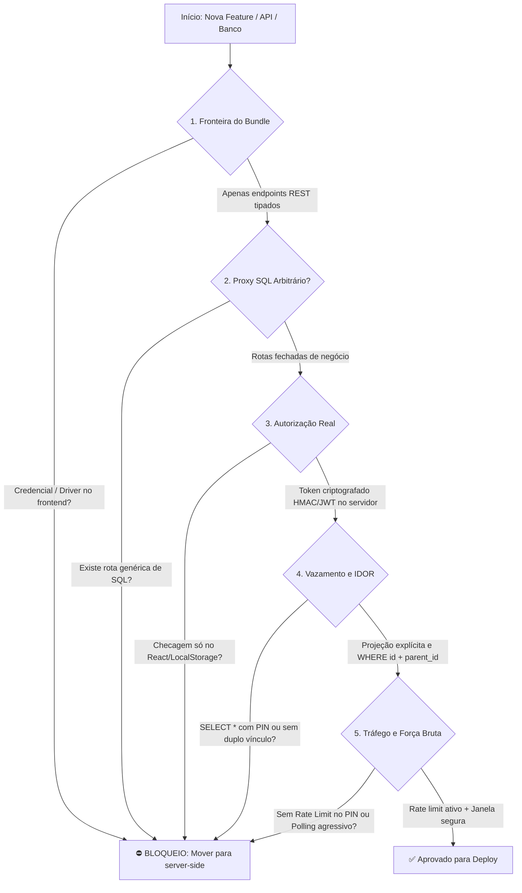

# Secure Architecture & Anti-Vulnerability Skill

Esta skill consolida as lições aprendidas e as diretrizes arquiteturais obrigatórias para desenvolvimento fullstack seguro (React, Vite/Next.js, Serverless Functions e PostgreSQL/Neon). Ela estabelece salvaguardas rigorosas para evitar vazamento de credenciais, injeção de comandos, bypass de permissões e negação de serviço.

---

## 1. As 6 Leis de Ferro da Arquitetura Segura



---

### Lei 1: Fronteira Rígida do Bundle (Zero Secrets in Frontend)
* **Regra Absoluta:** O código de cliente (`src/`) **JAMAIS** pode importar drivers de banco de dados (`@neondatabase/serverless`, `pg`, `prisma`, etc.) nem armazenar URLs de conexão direta com credenciais.
* **Armadilha de Bundlers (Vite / Next.js):** 
  * Qualquer variável iniciada com `VITE_` ou `NEXT_PUBLIC_` é compilada e embutida no JavaScript público baixado pelo navegador.
  * Credenciais de banco de dados e segredos de criptografia devem residir **exclusivamente** no lado do servidor em variáveis sem prefixo público (ex: `DATABASE_URL`, `SESSION_SECRET`).
* **Verificação Automatizada no Build:**
  ```bash
  npm run build && grep -rn "postgresql://" dist/ && grep -rn "npg_" dist/
  # O retorno DEVE ser completamente vazio (0 ocorrências).
  ```

---

### Lei 2: Proibição de Proxies SQL Abertos (Zero Raw SQL Endpoints)
* **O Risco:** Criar rotas de conveniência como `/api/sql` que recebem instruções SQL em texto puro (`req.text()` ou `{ query: "SELECT ..." }`). Isso transforma a aplicação em um console administrativo aberto na nuvem, permitindo que qualquer invasor execute `DROP TABLE`, acione SSRF ou leia dados de outras contas.
* **A Solução:**
  * Toda comunicação com o banco de dados deve ser mediada por **rotas de negócio fechadas, específicas e parametrizadas** (ex: `/api/sync`, `/api/room`, `/api/block`).
  * Todas as consultas devem utilizar *Prepared Statements* / parâmetros vinculados (`$1`, `$2`) fornecidos pelos drivers nativos. Concatenação de strings em SQL é expressamente proibida.
  * Valide a estrutura e o tamanho dos payloads antes de qualquer processamento (usando Zod ou validações de tamanho de string).

---

### Lei 3: Fim da Autorização Visual (O Cliente é Território Hostil)
* **O Risco (Client-Side Fallacy):** Condicionar segurança a verificações puramente visuais (`if (role === 'admin')`) ou armazenar papéis não assinados no `localStorage` / `sessionStorage`. Qualquer usuário pode abrir o DevTools (`F12`), alterar o estado local e disparar mutações.
* **A Solução:**
  * **Verificação de Credenciais Exclusiva no Servidor:** A conferência de senhas ou PINs de controle deve ocorrer dentro de funções serverless protegidas.
  * **Tokens de Sessão Assinados:** Após a autenticação, o servidor deve gerar um token criptográfico assinado (ex: **HMAC-SHA256** ou **JWT**) contendo o identificador da entidade e timestamp de expiração.
  * **Barreira no Backend:** Toda mutação administrativa ou sensível (excluir, alterar status, redefinir dados) deve exigir o token assinado no cabeçalho ou payload e recusar com `401 Unauthorized` ou `403 Forbidden` se a assinatura for inválida.

---

### Lei 4: Projeções Explícitas e Prevenção de IDOR
* **Projeção Mínima (Anti-Overfetching):**
  * **PROIBIDO** o uso de `SELECT *` em tabelas que possuam credenciais, hashes, tokens ou PINs.
  * *Inseguro:* `SELECT * FROM rooms WHERE code = $1` (vaza o `controller_pin` no JSON da resposta).
  * *Seguro:* `SELECT id, code, title, service_date, active_alert FROM rooms WHERE code = $1`.
* **Vínculo Duplo Estrito (Anti-IDOR):**
  * Nenhuma mutação ou exclusão em recursos subordinados deve confiar apenas no ID primário do item.
  * *Inseguro:* `UPDATE blocks SET content = $1 WHERE id = $blockId` (permite que qualquer usuário altere dados de outra conta conhecendo o UUID).
  * *Seguro:* `UPDATE blocks SET content = $1 WHERE id = $blockId AND room_id = $roomId`.
  * Se a contagem de linhas afetadas for zero, responda com `404 Not Found` para barrar a travessia indevida.

---

### Lei 5: Defesa no Banco de Dados (Row Level Security & Isolamento)
* **Row Level Security (RLS):**
  * Toda tabela que armazena dados de múltiplos usuários ou salas deve ter o RLS explicitamente habilitado:
    ```sql
    ALTER TABLE rooms ENABLE ROW LEVEL SECURITY;
    ALTER TABLE liturgical_blocks ENABLE ROW LEVEL SECURITY;
    ```
* **Cuidado com Superusuários:**
  * Em PostgreSQL (como no Neon), o usuário padrão `neondb_owner` possui o atributo `BYPASSRLS` ativo. Portanto, a primeira linha de defesa **sempre** é a camada de API serverless parametrizada; o RLS serve como barreira de contenção adicional.

---

### Lei 6: Proteção de Tráfego, Força Bruta e Consciência de WAF
* **Rate Limiting em Credenciais Curtas:**
  * Códigos numéricos ou PINs curtos (ex: 4 dígitos = 10.000 combinações) exigem limitador de taxa por IP (*sliding-window rate limiter*).
  * Padrão recomendado: 5 tentativas inválidas consecutivas geram bloqueio temporário (ex: 3 minutos).
* **Consciência de WAF e Dispositivos Legados:**
  * Evite polling excessivo em curto intervalo (ex: 1s-2s) de múltiplos dispositivos simultâneos. Isso aciona defesas contra DDoS e desafios antibot (Cloudflare/Vercel WAF - Erro 99).
  * Dispositivos legados (como tablets Android antigos) não conseguem resolver desafios JavaScript/WebAssembly modernos do WAF e acabam bloqueados.
  * Utilize estratégias de **Rascunho Local (`localStorage`)** para digitação (zero requisições durante a digitação de textos longos) e polling espaçado (ex: 15s a 30s) com backoff exponencial em caso de falha de conexão.

---

## 2. Checklist Pré-Deploy Obrigatório (Security Gate)

Antes de finalizar qualquer tarefa ou enviar commits para a branch principal (`main`), execute as seguintes validações:

- [ ] **1. Varredura de Segredos no Pacote:**
  ```bash
  npm run build
  grep -rn "postgresql://" dist/
  grep -rn "npg_" dist/
  ```
  *(Resultado esperado: 0 linhas encontradas).*

- [ ] **2. Auditoria de Dependências:**
  ```bash
  npm audit
  ```
  *(Resultado esperado: 0 vulnerabilidades de severidade alta ou crítica).*

- [ ] **3. Higiene do Repositório Git:**
  - Garantir que `.env`, `.env.local`, `.env.txt` e notas com credenciais estejam ignorados no [`.gitignore`](file:///Users/joaovitorbarreto/Projects/docs_church/.gitignore).
  - Verificar se nenhuma credencial real foi adicionada a documentações ou arquivos de teste.

- [ ] **4. Teste Prático de Injeção e Permissão (Caixa-Preta):**
  - Tentar disparar uma rota administrativa sem token (esperado: `401` ou `403`).
  - Tentar enviar ID de outra entidade para validar barreira contra IDOR (esperado: `404`).
