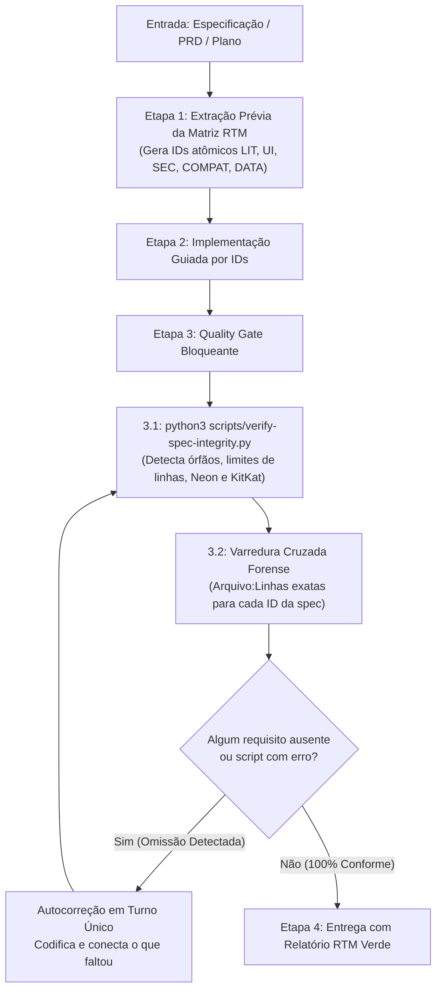

# Spec Compliance Guardian — Guardião de Conformidade & Zero Pontas Soltas

O **Spec Compliance Guardian** é a camada mandatória de governança técnica que impede o agente de esquecer requisitos litúrgicos, omitir botões, deixar componentes órfãos ou declarar falsos positivos de conclusão ao desenvolver features baseadas em planos de decomposição, especificações técnicas ou prompts de fase.

---

## 🚨 REGRA INVIOLÁVEL: PROIBIÇÃO DE CONCLUSÃO PREMATURA

> [!CRITICAL]
> **É TERMINANTEMENTE PROIBIDO declarar qualquer especificação, fase ou plano como "concluído" apenas executando linter ou checagem de tipos (`tsc`).**  
> Compiladores validam apenas sintaxe e tipos; eles **NÃO** sabem se você esqueceu um botão de oração urgente, deixou um componente desconectado no púlpito ou omitiu uma salvaguarda do banco Neon.
>
> **Antes de notificar o usuário com a resposta final, o agente DEVE OBRIGATORIAMENTE:**
> 1. Executar o script determinístico: `python3 scripts/verify-spec-integrity.py`.
> 2. Realizar a Varredura Cruzada Forense preenchendo a **Matriz RTM (Requirements Traceability Matrix)** com arquivo e linhas exatas (`[Arquivo.tsx#L10-L25]`).
> 3. Se encontrar qualquer omissão ou componente desconectado, **AUTOCORRIGIR IMEDIATAMENTE no mesmo turno** antes de responder.

---

## 🎯 Quando Usar
Esta skill opera em dois modos:
1. **Modo Automático Mandatório:** Ativado compulsoriamente pela Regra 7 do `AGENTS.md` em toda tarefa que possua especificação técnica, PRD, plano de fase (`docs/`) ou múltiplos requisitos.
2. **Modo Sob Demanda:** Acionado quando o usuário solicitar auditoria explícita:
   - **Triggers:** `/spec-guard`, `/audit-spec`, `"auditar conformidade"`, `"verificar pontas soltas"`, `"auditar se faltou algo da especificação"`.

---

## ⚙️ O Protocolo Dual-Phase em 4 Etapas



---

### 📋 Etapa 1: Extração Prévia da Matriz RTM (Antes de Escrever Código)
Antes de modificar ou criar qualquer arquivo, o agente decompõe a especificação recebida em uma lista de requisitos atômicos estruturados:

- **`LIT-XX`**: Regras de negócio da liturgia (5 blocos litúrgicos, PIN de 4 dígitos, sessão HMAC-SHA256, pedidos urgentes em `#991B1B`, rascunhos sem requisições, exportações Holyrics/WhatsApp).
- **`UI-XX`**: Componentes visuais do Púlpito, Obreiro e Mesa (Púlpito Zen, espelho de 2 páginas na paisagem, zero scroll vertical, modais desacoplados).
- **`SEC-XX`**: Fronteira Serverless (zero drivers `@neondatabase/serverless` ou `pg` no client `src/`, prepared statements em `api/`).
- **`COMPAT-XX`**: Compatibilidade Android 4.4.4 KitKat (CSS clássico, cores em Hexadecimal/RGB, zero `oklch()`).
- **`DATA-XX`**: Sincronização, fila otimista (`blockMutationQueueRef`) e resiliência offline em `localStorage`.

Cada requisito DEVE ter um **Critério Binário de Aceite** inequívoco (ex: *"Componente X montado no púlpito exibindo badge urgente com cor #991B1B"*).

---

### 💻 Etapa 2: Implementação
O agente desenvolve as alterações no código orientando-se diretamente pelos IDs extraídos na Matriz RTM.

---

### 🛡️ Etapa 3: Quality Gate Bloqueante Pré-Encerramento
Antes de enviar qualquer resposta de conclusão:

#### 3.1 Execução do Script Determinístico
Execute via ferramenta de terminal:
```bash
python3 scripts/verify-spec-integrity.py
```
O script verifica automaticamente:
- **Componentes Órfãos:** Arquivos `.tsx` criados ou modificados em `src/components/` que não são importados em nenhuma tela ativa.
- **Barrels sem Consumo Real:** Componentes apenas exportados no `index.ts` sem consumo no app.
- **Regras do `AGENTS.md`:** Limite estrito de 200 linhas (alerta > 180), fronteira serverless Neon no client e compatibilidade KitKat (`oklch()`).
- **Compilação e Segurança:** `npx tsc --noEmit`, `npm run build` e varredura de credenciais em `dist/`.

Se o script retornar código `1` (erro), o agente é **proibido de devolver a resposta**.

#### 3.2 Varredura Cruzada Forense (Matriz de Evidências)
O agente percorre a especificação linha a linha e preenche a tabela de conformidade forense:

| ID | Requisito da Especificação | Arquivo Auditado | Linhas Exatas | Evidência de Integração Comprovada | Status |
|:---|:---|:---|:---:|:---|:---:|
| `LIT-01` | Fila otimista para orações presenciais | `useBlockMutations.ts` | `L45-L62` | `blockMutationQueueRef` enfileirando mutação com retry | ✅ CONFORME |
| `UI-01` | Spread de 2 páginas no púlpito paisagem | `PulpitView.tsx` | `L80-L95` | `PulpitSpreadLayout` montado sem scroll vertical | ✅ CONFORME |
| `SEC-01` | Token HMAC-SHA256 para o controlador | `api/room.ts` | `L110-L130` | Assinatura com `SESSION_SECRET` validando role | ✅ CONFORME |

#### 3.3 Autocorreção em Turno Único (Sem Repassar Trabalho ao Usuário)
Se o agente identificar que um botão foi esquecido, um componente não foi montado ou um bloco não recalcula o estado:
- **NÃO pergunte ao usuário se deve implementar.**
- **NÃO diga que ficou para depois.**
- Implemente imediatamente o código faltante, reexecute o script e atualize a tabela até que todos os itens estejam com status `✅ CONFORME`.

---

### 🎯 Etapa 4: Entrega Consolidada
O agente conclui a tarefa apresentando ao usuário:
1. Saída de sucesso do `verify-spec-integrity.py`.
2. A Matriz RTM com links clicáveis em formato markdown para os arquivos e linhas (`[Arquivo.tsx#L10-L25](file:///...)`).
3. Roteiro prático para teste visual do usuário no navegador.

---

## 📚 Referências
- Template da Matriz RTM: [`references/rtm-checklist-template.md`](references/rtm-checklist-template.md)
- Script de Verificação: [`scripts/verify-spec-integrity.py`](../../../scripts/verify-spec-integrity.py)
