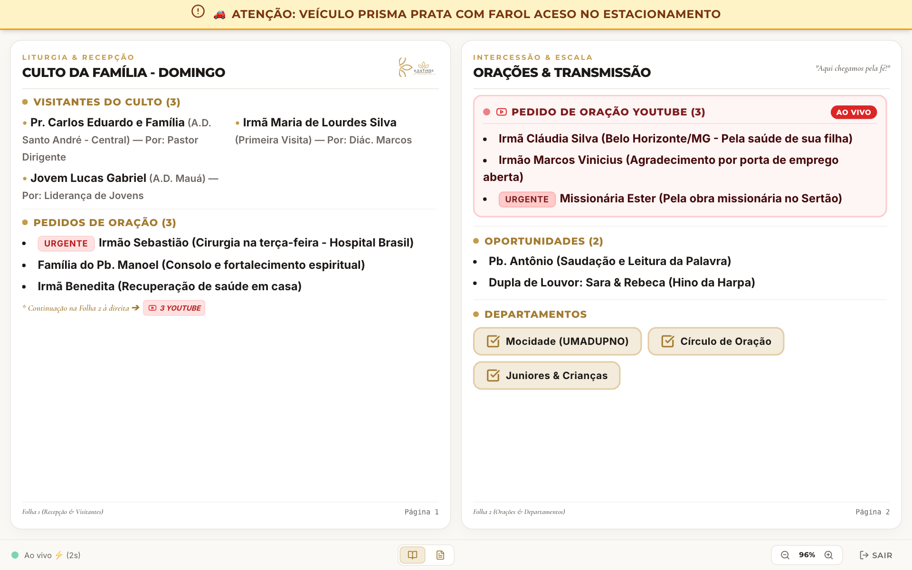
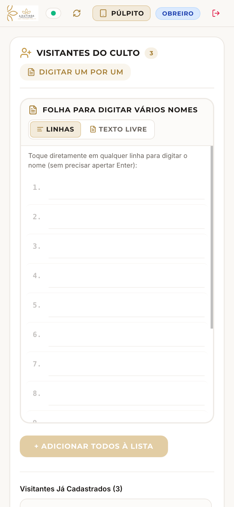
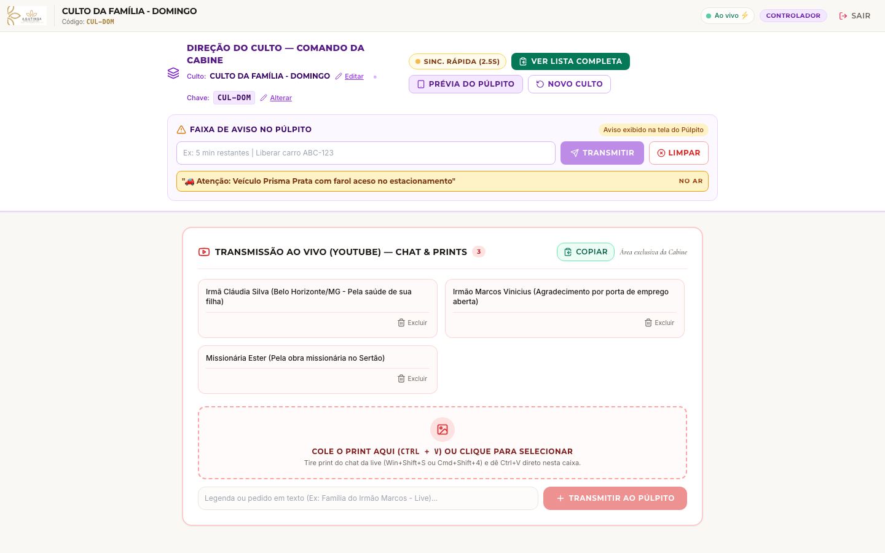

# ⚡ Ficha de Apoio Rápido — Docs Church ADUPNO
### *Guia de Mesa e Púlpito para Consulta Imediata durante o Culto*

> **Código da Sala Padrão:** `CUL-DOM` (ou o código anunciado no dia)  
> **Acesso:** Basta abrir o navegador e digitar o endereço do sistema da igreja.

---

## ⏱️ Checklist de 3 Minutos Antes do Culto Começar

- [ ] **Tablet do Púlpito:** Ligar o tablet no suporte, abrir o app, escolher **PÚLPITO** e conferir se a tela em duas folhas está aberta.
- [ ] **Cabine de Som/Mídia:** Entrar como **DIREÇÃO (PIN)**, conferir o título do culto e clicar em **"Novo Culto"** caso ainda haja anotações do culto anterior.
- [ ] **Recepção/Diaconia:** Entrar pelo celular como **OBREIRO**, pronto para digitar os primeiros visitantes.

---

## 📌 Guia Expresso das 3 Funções

| Função | Quem Usa? | Como Acessar? | O que faz no culto? |
| :--- | :--- | :--- | :--- |
| 📖 **PÚLPITO** | Pastor e Dirigentes | Escolher **PÚLPITO** | Lê a liturgia, visitantes e pedidos de oração em tela dupla sem rolagem. Toque lateral para virar a folha. |
| ✏️ **OBREIRO** | Diaconia e Secretaria | Escolher **OBREIRO** | Digita visitantes, anota pedidos de oração e marca os conjuntos que vão cantar. |
| 🛡️ **DIREÇÃO** | Mídia e Direção de Culto | Escolher **DIREÇÃO** + PIN | Envia avisos na barra amarela do altar, cola prints da live do YouTube e gera a ata completa. |

---

## 📖 1. Cartão do Púlpito (Para o Pastor)

  

1. **Leitura Direta:** Folha da esquerda = Visitantes e Orações Presenciais. Folha da direita = Pedidos do YouTube, Oportunidades e Conjuntos.
2. **Virar a Página:** Dê um toque suave na borda direita da tela ou use os botões no rodapé.
3. **Faixa Amarela no Topo:** Se aparecer uma tarja amarela, é um recado discreto da direção para você.
4. **Internet Caiu?** Não se preocupe! A folha continua aberta normalmente na sua mão.

---

## ✏️ 2. Cartão do Obreiro (Recepção & Secretaria)

  

1. **Cadastrar Visitantes:** Toque na folha de linhas numeradas, digite o nome e toque em **"+ Adicionar à Lista"**.
2. **Pedidos de Oração:** Digite o motivo da congregação. Se for caso de hospital/emergência, marque a opção **"Urgente"**.
3. **Conjuntos:** Conforme os departamentos chegarem, marque a caixinha do grupo (Mocidade, Varões, Círculo de Oração, etc.).
4. **Errou algum nome?** Clique no ícone de **Lixeira** ao lado do nome para apagar e cadastrar novamente.

---

## 🛡️ 3. Cartão do Controlador (Cabine de Som & Mídia)

  

1. **Enviar Aviso Silencioso ao Púlpito:**
   - Digite o recado no campo *"FAIXA DE AVISO NO PÚLPITO"* (ex: `🚗 Farol do carro prata aceso`).
   - Clique em **"TRANSMITIR"**.
   - Para tirar da tela, clique em **"LIMPAR"**.
2. **Pedidos do Chat do YouTube:**
   - No computador da transmissão: aperte `Windows + Shift + S` para recortar o comentário do YouTube.
   - Dê **`Ctrl + V`** dentro da caixa de print do Docs Church e clique em **"Transmitir ao Púlpito"**.
3. **Final do Culto (Exportar Relatório):**
   - Clique em **"VER LISTA COMPLETA"** → **"Copiar para Área de Transferência"**.
   - Cole no WhatsApp dos pastores ou arquive no documento da secretaria.

---

## 🆘 Atalhos & Dúvidas Rápidas

- **Onde vejo se está conectado?** No topo direito, uma luzinha verde indica **"Ao Vivo"**. Se ficar âmbar, está trabalhando em modo offline seguro.
- **O código da sala mudou?** A liderança na cabine pode clicar em *"Alterar Chave"* no painel do controlador para ajustar o código do culto a qualquer momento.
- **Como ver o que o pastor está vendo?** Na cabine, clique no botão roxo **"PRÉVIA DO PÚLPITO"** para ver a réplica exata do tablet do altar em tempo real.

---
*A.D. Utinga — Parque Novo Oratório | Diaconia & Comunicação*
