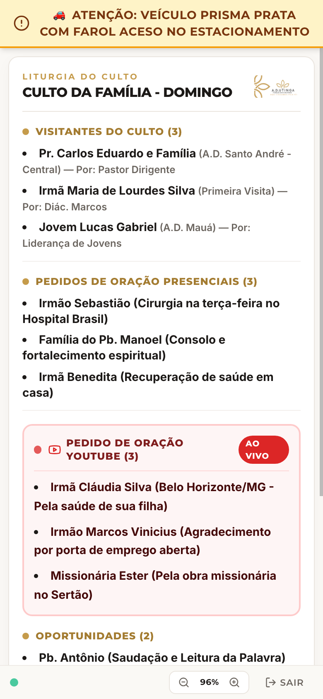
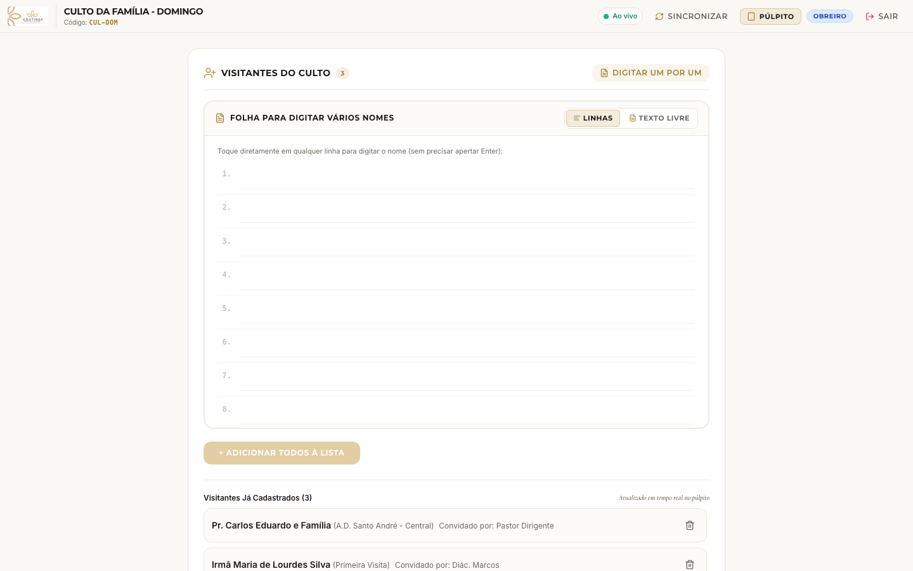
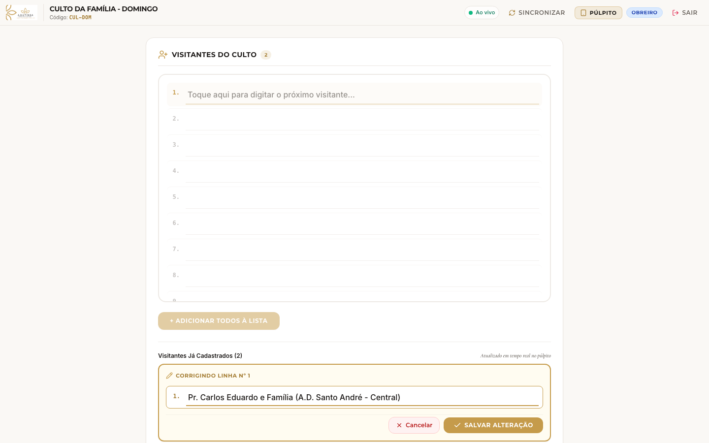

# 📖 Manual de Uso do Painel do Culto — A.D. Utinga (PNO)
### *Guia Prático e Ilustrado para o Ministério, Diaconia, Secretaria e Mídia*

> *"Tudo, porém, seja feito com decência e ordem."* — 1 Coríntios 14:40

---

## 🌟 O que é o Painel do Culto?

O **Painel do Culto** é a ferramenta digital da congregação criada para substituir papéis soltos, recadinhos de última hora e arquivos do Google Docs durante o culto.

Ele funciona de forma **sincronizada em tempo real**: quando o irmão da recepção anota um visitante no celular ou a equipe do YouTube registra um pedido de oração, as informações aparecem **no mesmo segundo** na tela do tablet ou celular do Pastor no altar.

```
       [ 📱 Irmão na Recepção ]      [ 💻 Equipe de Mídia ]
           (Cadastra na Folha)           (Avisa no Púlpito)
                     │                           │
                     ▼                           ▼
          ══════════════════════════════════════════════
                     NUVEM EM TEMPO REAL
          ══════════════════════════════════════════════
                                 │
                                 ▼
                     [ 📖 Tablet no Púlpito ]
                     (Leitura Limpa do Pastor)
```

---

## 🚀 Passo 0: Como Entrar no Sistema

Para abrir o aplicativo no celular, computador ou tablet, basta abrir o navegador de internet e acessar o endereço da igreja.


### O que fazer na Tela Inicial:
1. **Digite o Código do Culto:** É um código simples de 6 letras (por exemplo: `EBD-DOM` ou `CUL-DOM`). O irmão da direção ou da mídia informará o código do dia. *(O sistema se lembra do último código digitado para facilitar nos próximos cultos!)*
2. **Escolha quem está usando agora:**
   - 📖 **PÚLPITO (Altar):** Escolha esta opção se você for o Pastor ou se o aparelho for o tablet fixado no púlpito.
   - ✏️ **OBREIRO (Apoio):** Escolha esta opção se você estiver na recepção, na secretaria ou ajudando na nave da igreja.
   - 🛡️ **DIREÇÃO (PIN):** Escolha esta opção se você estiver na mesa de som/mídia dirigindo o culto (protegido por PIN de 4 números).
3. **Toque no botão dourado:** **"ACESSAR CULTO"**.

---

## 📖 Função 1: O Púlpito (Visão do Pastor e Dirigentes)

Esta tela foi desenhada para dar **total paz e foco espiritual** para quem está ministrando a Palavra ou dirigindo o momento de oração.

### 📱 Visualização Inteligente por Aparelho

|                      No Tablet do Púlpito (Modo Livro Aberto)                       |                   No Smartphone do Pastor (Folha Única)                    |
| :---------------------------------------------------------------------------------: | :------------------------------------------------------------------------: |
|                            |                |
| *Duas folhas lado a lado, sem barra de rolagem, simulando uma pasta aberta solene.* | *Adaptação automática para leitura vertical contínua e nítida no celular.* |

### 4 Regras de Ouro do Púlpito:
1. **Zero Rolagem no Tablet (Não precisa rolar para baixo):**
   - No tablet em modo paisagem, o sistema mostra as duas folhas lado a lado, como um **livro aberto**.
   - As letras são grandes, nítidas e com alto contraste, pensadas para leitura confortável mesmo de pé e a certa distância.
2. **Adaptação Automática para Smartphone:**
   - Se o pastor abrir pelo próprio celular pessoal, o app detecta a tela pequena e ativa automaticamente o modo de folha única vertical, sem exigir configurações.
3. **Como Virar a Folha (Tablet):**
   - Se houver muitos nomes e o conteúdo passar para a próxima página, basta dar um **toque suave na lateral da tela** ou nas setas do rodapé. A equipe da mesa de som também pode avançar a página remotamente pela cabine.
4. **Faixa de Alerta Superior (Amarelo Solene):**
   - Caso haja um aviso importante e discreto (por exemplo: *"🚗 Veículo Prisma Prata com farol aceso"* ou *"⏳ 5 minutos restantes"*), uma faixa suave aparece no topo da tela sem cobrir os textos da liturgia.

> [!TIP]
> **E se a internet da igreja oscilar durante o culto?**
> Fique tranquilo! O Painel do Culto possui proteção contra quedas. As informações ficam gravadas na memória do aparelho. A tela **nunca fica branca** e **não trava**. Quando a internet voltar, ela atualiza sozinha em silêncio.

---

## ✏️ Função 2: O Obreiro (Recepção, Secretaria e Apoio)

Esta função foi totalmente redesenhada para ser **100% acessível e acolhedora**, mesmo para irmãos idosos ou que têm pouca intimidade com computadores. Ela funciona com a metáfora de uma **folha de caderno pautada**.


### 1. Cadastrando Visitantes na Folha Pautada
1. No topo da tela, você verá a folha de linhas numeradas (1, 2, 3...).
2. **Basta tocar na primeira linha** e começar a digitar:
   - Exemplo: `Pr. Carlos Eduardo e Família (A.D. Santo André)`
   - Exemplo: `Irmã Maria de Lourdes Silva (Convidada pelo Diácono Marcos)`
3. Dê `Enter` para pular para a próxima linha e anote quantos visitantes chegarem.
4. Quando terminar o grupo, toque no botão dourado **"+ ADICIONAR TODOS À LISTA"**.
5. Na mesma hora, todos os nomes vão para o púlpito do pastor e a folha se limpa para os próximos que chegarem!



---

### 2. Errou uma Letra ou Nome? Use o Botão "✏️ Corrigir"
Você **não precisa apagar o visitante e digitar tudo de novo**!



1. Logo abaixo da folha, na lista de **"Visitantes Já Cadastrados"**, encontre o nome que precisa de ajuste.
2. Toque no botão dourado **`✏️ CORRIGIR`**.
3. A linha se abrirá em um cartão dourado com a linha pautada e o texto pronto para ser editado.
4. O campo ajusta o tamanho automaticamente se o texto for longo.
5. Corrija o que precisar e clique em **`✓ SALVAR ALTERAÇÃO`** (ou aperte `Enter`).
6. A correção é transmitida imediatamente ao pastor no altar!

---

### 3. Anotando Pedidos de Oração Presenciais
1. Vá até a seção **Pedidos de Oração (Presenciais)**.
2. Digite o motivo diretamente na folha pautada de 15 linhas:
   - Exemplo: `Irmão Sebastião (Cirurgia na terça-feira no Hospital Brasil)`
   - Exemplo: `Família do Pb. Manoel (Consolo e fortalecimento)`
3. Toque em **"+ Adicionar Todos os Pedidos"**.
4. Se precisar corrigir um detalhe do pedido durante o culto, basta usar o botão **`✏️ Corrigir`** ao lado do pedido cadastrado.

---

### 4. Oportunidades & Departamentos
- **Oportunidades:** Segue exatamente o mesmo modelo da folha pautada: digite o nome do irmão ou dupla que terá oportunidade de louvor ou testemunho e clique em adicionar.
- **Departamentos / Conjuntos:** Basta marcar com um toque a caixinha do conjunto que irá louvar (ex: *Mocidade*, *Círculo de Oração*, *Varões*, *Juniores*). O pastor vê a caixinha marcada no tablet em tempo real.

---

## 🛡️ Função 3: O Controlador (Direção de Culto e Cabine de Mídia)

O Controlador é o painel de comando do culto, protegido por **senha de 4 dígitos (PIN)** para a mesa de som e direção de culto.


### 1. Enviando Avisos Silenciosos ao Púlpito
Precisa se comunicar com o pastor no altar sem subir escadas e sem interromper a pregação?
1. No campo **"FAIXA DE AVISO NO PÚLPITO"**, digite o recado:
   - Exemplo 1: `🚗 Placa ABC-1234 com farol aceso`
   - Exemplo 2: `⏳ Faltam 10 minutos para encerrar`
   - Exemplo 3: `👶 Berçário: Chamar os pais do pequeno Miguel`
2. Clique no botão roxo **"TRANSMITIR"**.
3. O aviso entra instantaneamente na faixa amarela do tablet do altar.
4. Quando o pastor ler ou o recado for resolvido, clique no botão vermelho **"LIMPAR"**.

### 2. Transmissão ao Vivo (YouTube) — Chat & Prints
A equipe de mídia e transmissão pode lançar pedidos da live com facilidade surpreendente:
- **Tirando Print:** No computador da transmissão, aperte `Windows + Shift + S` (ou `Cmd + Shift + 4` no Mac) para recortar o comentário no YouTube.
- Dê **`Ctrl + V`** diretamente na caixa vermelha pontilhada do app!
- A imagem do comentário é otimizada na hora e sobe para a folha do pastor. Você também pode digitar a legenda em texto se preferir.

### 3. Copiar a Lista Completa para a Ata / Secretaria
No final do culto, para salvar o relatório ou colar no grupo de WhatsApp da liderança:
1. Clique no botão verde **"VER LISTA COMPLETA"**.
2. O sistema formata todos os visitantes, orações e oportunidades com o cabeçalho da igreja.
3. Clique em **"Copiar"** e cole no WhatsApp, Google Docs ou Bloco de Notas.

### 4. Começando um Novo Culto (Limpar Folha)
No próximo culto (por exemplo, na terça-feira ou no domingo seguinte):
1. Clique no botão **"NOVO CULTO"**.
2. Digite o nome do novo culto e confirme. O sistema arquiva as anotações antigas e abre uma folha limpa mantendo o mesmo código de sala.

---

## 🛠️ O que fazer se... (Perguntas Frequentes)

### 1. "O tablet do pastor ficou com o pontinho âmbar no rodapé."
> O pontinho âmbar indica que o Wi-Fi oscilou. O pastor continuará lendo normalmente o que já estava na tela, sem travar nem fechar. Assim que o sinal restabelecer, o pontinho volta a ficar verde (**Ao Vivo**) sozinho.

### 2. "Se a internet cair enquanto o obreiro digita, corrige ou apaga algo?"
> O sistema possui uma **fila offline inteligente**. Todas as anotações, correções e exclusões feitas sem internet ficam salvas na memória do aparelho e são sincronizadas automaticamente com o altar assim que a conexão retornar.

### 3. "Cadastrei um visitante ou pedido errado, preciso apagar tudo?"
> **Não!** Basta tocar no botão dourado **`✏️ CORRIGIR`** ao lado do item. A linha se abrirá para edição imediata. Ajuste o nome e clique em **`✓ Salvar Alteração`**.

### 4. "O Pastor quer aumentar a letra no tablet."
> No rodapé do púlpito, há botões com ícones de lupa e porcentagem (ex: `96%`). Basta dar um toque no `+` ou `-` para aproximar ou afastar o texto conforme o conforto visual do pregador.

---

## 📞 Contatos & Apoio
- **Congregação:** Assembleia de Deus — Parque Novo Oratório (ADUPNO)
- **Equipe Responsável:** Secretaria, Diaconia & Departamento de Comunicação
- *"Aqui chegamos pela fé!"*
